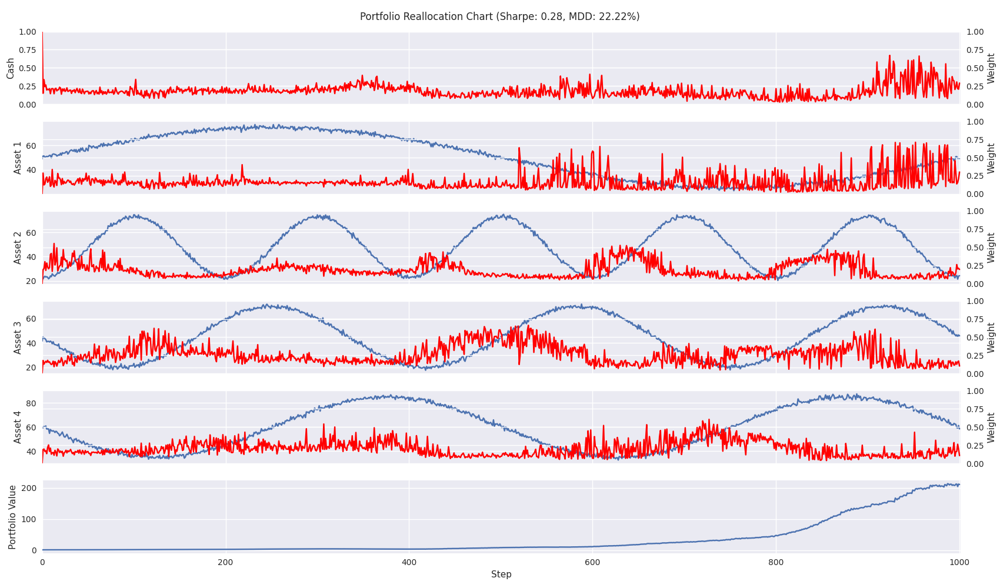

# Portfolio Allocation with TensorTrade

This project serves as a guide for how to make more complex environments in TensorTrade. This code can either run locally or within a Docker container. Just make sure that all the libraries needed are properly downloaded when running locally.

## Local (Virtual Envionment)
```sh
$ pip install -r requirements
```

## Docker
If you are going to run the in the docker container use,
```sh
$ docker build -t penv .
$ docker run -it -v $PWD:/app --entrypoint /bin/bash penv
```

## Commands
Run all of the following commands in order to ensure proper functionality.

To tune run,
```sh
$ python -m penv.tune --num-samples=4 --num-workers=8
```

To train run,
```sh
$ python -m penv.train --num-workers=8
```

To evaluate and render a chart for an episode run,
```sh
$ python -m penv.evaluate --price-type=gbm
```



## References
* Jiang, Zhengyao, Dixing Xu, and Jinjun Liang. “A Deep Reinforcement Learning Framework for the Financial Portfolio Management Problem.” ArXiv.org (2017). Web. <https://arxiv.org/abs/1706.10059>.
